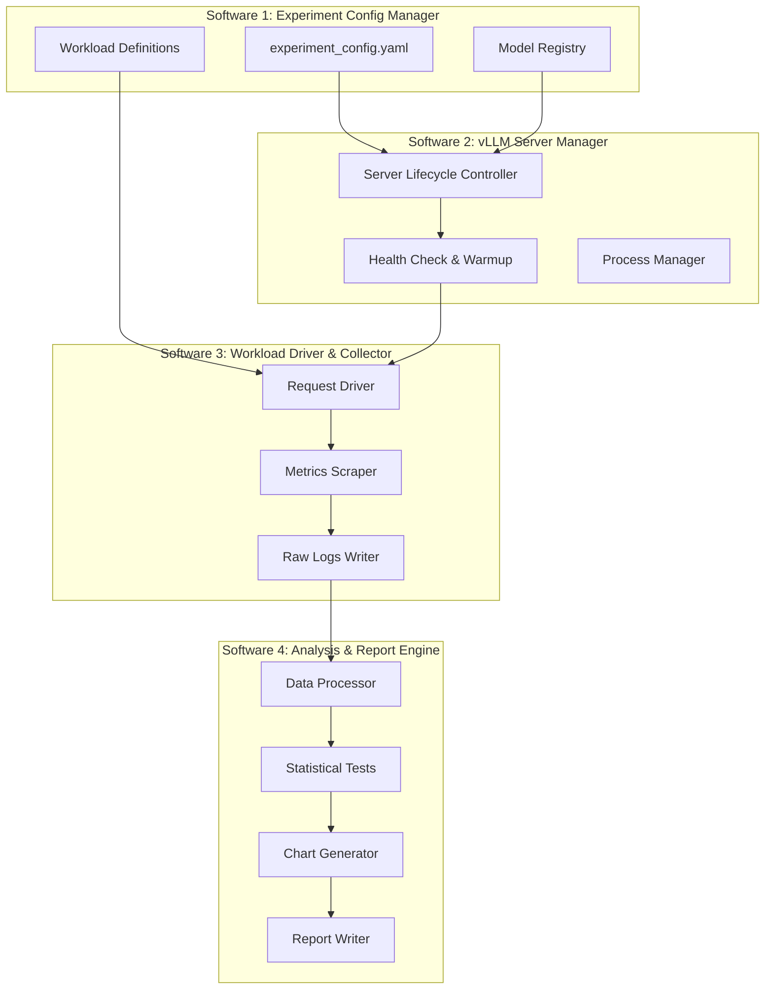

# Speculative Decoding Benchmark System — Software Architecture

## 1. Overview

This system benchmarks **quantized self-speculation** on Gemma 4 models using vLLM, comparing dense vs MoE verifier architectures. The system comprises four independent software components that form a pipeline: configure → serve → drive → analyze.

### Experimental Matrix

| Cell | Verifier (bf16) | Draft (Q4) | Hypothesis |
|------|-----------------|------------|------------|
| A | Gemma 4 31B Dense | Gemma 4 31B Q4 (GPTQ/AWQ) | Baseline self-speculation on dense architecture |
| B | Gemma 4 26B-A4B MoE | Gemma 4 26B-A4B Q4 (GPTQ/AWQ) | MoE routing sensitivity to quantization noise |

Each cell is swept across:

- **Speculation length k**: {1, 3, 5, 7}
- **Temperature**: {0.0, 0.7}
- **Workloads**: HumanEval (code), ShareGPT-slice (open-ended chat)

**Total configurations**: 2 cells × 4 k-values × 2 temperatures × 2 workloads = **32 runs**

### System Diagram



---

## 2. Software 1 — Experiment Config Manager

### Purpose

Single source of truth for all experiment parameters. Every other component reads from this. No hardcoded values anywhere else in the system.

### Structure

```
spec-bench/
├── configs/
│   ├── experiment.yaml          # Master experiment definition
│   ├── models/
│   │   ├── gemma4-31b-dense.yaml
│   │   └── gemma4-26b-moe.yaml
│   └── workloads/
│       ├── humaneval.yaml
│       └── sharegpt.yaml
├── workload_data/
│   ├── humaneval_prompts.jsonl  # Pre-extracted HumanEval prompts
│   └── sharegpt_slice.jsonl    # 200-sample ShareGPT subset
└── config_manager.py           # Pydantic models + config loader
```

### Master Config Schema

```yaml
# experiment.yaml
experiment:
  name: "gemma4-self-spec-dense-vs-moe"
  version: "1.0"
  timestamp_prefix: true          # auto-prefix output dirs with ISO timestamp

hardware:
  gpu_sku: "H100-80GB"            # UPDATE THIS to match your actual hardware
  gpu_count: 1
  vram_gb: 80

cells:
  - id: "dense-31b"
    verifier:
      model_id: "google/gemma-4-31B-it"
      dtype: "bfloat16"
      vram_estimate_gb: 62
    draft:
      model_id: "YOUR_ORG/gemma-4-31B-it-GPTQ-4bit"  # quantize yourself or find on HF
      quantization: "gptq"                              # or "awq"
      vram_estimate_gb: 16
    total_vram_gb: 78

  - id: "moe-26b"
    verifier:
      model_id: "google/gemma-4-26B-A4B-it"
      dtype: "bfloat16"
      vram_estimate_gb: 52
    draft:
      model_id: "YOUR_ORG/gemma-4-26B-A4B-it-GPTQ-4bit"
      quantization: "gptq"
      vram_estimate_gb: 14
    total_vram_gb: 66

sweep:
  num_speculative_tokens: [1, 3, 5, 7]
  temperatures: [0.0, 0.7]

workloads:
  - id: "humaneval"
    data_path: "workload_data/humaneval_prompts.jsonl"
    num_prompts: 164                # full HumanEval
    max_output_tokens: 512
    description: "Code generation — high acceptance regime"
  - id: "sharegpt"
    data_path: "workload_data/sharegpt_slice.jsonl"
    num_prompts: 200
    max_output_tokens: 1024
    description: "Open-ended chat — harder acceptance regime"

baselines:
  run_no_speculation: true         # run each verifier without spec decode as baseline
  warmup_requests: 10              # throwaway requests before measurement

vllm_defaults:
  gpu_memory_utilization: 0.90
  max_model_len: 4096              # keep short to fit both models in VRAM
  enforce_eager: false
  block_size: 16
  max_num_seqs: 1                  # batch=1 for v1 of experiment
  enable_prefix_caching: false     # disable to avoid confounding variable
```

### Config Manager Implementation

```python
# config_manager.py
"""
Loads, validates, and expands experiment configurations into
a flat list of runnable benchmark configurations.
"""
from __future__ import annotations

import itertools
import yaml
from pathlib import Path
from dataclasses import dataclass, field
from datetime import datetime


@dataclass(frozen=True)
class RunConfig:
    """Single benchmark run — fully specified, no ambiguity."""
    run_id: str
    cell_id: str
    verifier_model: str
    verifier_dtype: str
    draft_model: str
    draft_quantization: str
    num_speculative_tokens: int
    temperature: float
    workload_id: str
    workload_path: str
    max_output_tokens: int
    is_baseline: bool              # True = no speculation, just the verifier
    vllm_port: int
    max_model_len: int
    gpu_memory_utilization: float
    max_num_seqs: int


def load_experiment(config_path: str = "configs/experiment.yaml") -> list[RunConfig]:
    """Parse YAML config and expand sweep into flat list of RunConfigs."""
    with open(config_path) as f:
        cfg = yaml.safe_load(f)

    runs: list[RunConfig] = []
    run_counter = 0
    port_base = 8000

    for cell in cfg["cells"]:
        for workload in cfg["workloads"]:
            # Baseline run (no speculation)
            if cfg["baselines"]["run_no_speculation"]:
                runs.append(RunConfig(
                    run_id=f"run_{run_counter:04d}_baseline_{cell['id']}_{workload['id']}",
                    cell_id=cell["id"],
                    verifier_model=cell["verifier"]["model_id"],
                    verifier_dtype=cell["verifier"]["dtype"],
                    draft_model="",
                    draft_quantization="",
                    num_speculative_tokens=0,
                    temperature=0.0,
                    workload_id=workload["id"],
                    workload_path=workload["data_path"],
                    max_output_tokens=workload["max_output_tokens"],
                    is_baseline=True,
                    vllm_port=port_base,
                    max_model_len=cfg["vllm_defaults"]["max_model_len"],
                    gpu_memory_utilization=cfg["vllm_defaults"]["gpu_memory_utilization"],
                    max_num_seqs=cfg["vllm_defaults"]["max_num_seqs"],
                ))
                run_counter += 1

            # Speculative runs (sweep k × temperature)
            for k, temp in itertools.product(
                cfg["sweep"]["num_speculative_tokens"],
                cfg["sweep"]["temperatures"],
            ):
                runs.append(RunConfig(
                    run_id=f"run_{run_counter:04d}_{cell['id']}_k{k}_t{temp}_{workload['id']}",
                    cell_id=cell["id"],
                    verifier_model=cell["verifier"]["model_id"],
                    verifier_dtype=cell["verifier"]["dtype"],
                    draft_model=cell["draft"]["model_id"],
                    draft_quantization=cell["draft"]["quantization"],
                    num_speculative_tokens=k,
                    temperature=temp,
                    workload_id=workload["id"],
                    workload_path=workload["data_path"],
                    max_output_tokens=workload["max_output_tokens"],
                    is_baseline=False,
                    vllm_port=port_base,
                    max_model_len=cfg["vllm_defaults"]["max_model_len"],
                    gpu_memory_utilization=cfg["vllm_defaults"]["gpu_memory_utilization"],
                    max_num_seqs=cfg["vllm_defaults"]["max_num_seqs"],
                ))
                run_counter += 1

    return runs
```

### VRAM Budget Validation

This is the first gate. If the config doesn't fit on your GPU, the system should fail immediately with a clear message, not OOM 20 minutes into a run.

```python
def validate_vram(cfg: dict) -> None:
    """Fail fast if any cell exceeds available VRAM."""
    available = cfg["hardware"]["vram_gb"]
    kv_cache_overhead_gb = 4  # conservative estimate at max_model_len=4096, batch=1

    for cell in cfg["cells"]:
        required = cell["total_vram_gb"] + kv_cache_overhead_gb
        headroom = available - required
        if headroom < 0:
            raise ValueError(
                f"Cell '{cell['id']}' needs ~{required}GB but GPU has {available}GB. "
                f"Options: reduce max_model_len, use FP8 verifier, or use larger GPU."
            )
        if headroom < 4:
            print(f"WARNING: Cell '{cell['id']}' has only ~{headroom}GB headroom. "
                  f"Expect KV cache pressure on longer sequences.")
```

---

## 3. Software 2 — vLLM Server Manager

### Purpose

Manages the lifecycle of vLLM server processes: start with the correct flags per RunConfig, wait for health, run warmup, signal readiness, and tear down cleanly between configurations.

### Structure

```
spec-bench/
├── server_manager/
│   ├── __init__.py
│   ├── launcher.py         # Start/stop vLLM server processes
│   ├── health.py           # Health check polling
│   └── warmup.py           # Send throwaway requests to stabilize CUDA graphs
```

### vLLM Launch Command Builder

```python
# server_manager/launcher.py
"""
Builds and manages vLLM server processes for each benchmark configuration.
"""
from __future__ import annotations

import subprocess
import signal
import time
import logging
from pathlib import Path

from config_manager import RunConfig

logger = logging.getLogger(__name__)

# Pin this. Behavior changes between versions.
VLLM_VERSION_TESTED = "0.8.x"  # UPDATE to your actual installed version


def build_vllm_command(run: RunConfig) -> list[str]:
    """
    Construct the vllm serve command for a given RunConfig.

    For baseline runs (no speculation), omits --speculative-config entirely.
    For speculative runs, passes the draft model and quantization method.
    """
    cmd = [
        "vllm", "serve", run.verifier_model,
        "--dtype", run.verifier_dtype,
        "--port", str(run.vllm_port),
        "--gpu-memory-utilization", str(run.gpu_memory_utilization),
        "--max-model-len", str(run.max_model_len),
        "--max-num-seqs", str(run.max_num_seqs),
        "--block-size", "16",
        "--disable-log-requests",
        "--enable-metrics",
    ]

    if not run.is_baseline:
        # Speculative decoding flags
        spec_config = (
            f'{{"model": "{run.draft_model}", '
            f'"num_speculative_tokens": {run.num_speculative_tokens}, '
            f'"quantization": "{run.draft_quantization}"}}'
        )
        cmd.extend(["--speculative-config", spec_config])

    return cmd


class VLLMServerProcess:
    """Manages a single vLLM server subprocess."""

    def __init__(self, run: RunConfig):
        self.run = run
        self.process: subprocess.Popen | None = None

    def start(self) -> None:
        cmd = build_vllm_command(self.run)
        logger.info(f"Starting vLLM for {self.run.run_id}: {' '.join(cmd)}")

        self.process = subprocess.Popen(
            cmd,
            stdout=subprocess.PIPE,
            stderr=subprocess.STDOUT,
            text=True,
        )

    def stop(self, timeout: int = 30) -> None:
        if self.process is None:
            return
        logger.info(f"Stopping vLLM for {self.run.run_id} (PID {self.process.pid})")
        self.process.send_signal(signal.SIGTERM)
        try:
            self.process.wait(timeout=timeout)
        except subprocess.TimeoutExpired:
            logger.warning(f"vLLM did not exit cleanly, sending SIGKILL")
            self.process.kill()
            self.process.wait()
        self.process = None

    @property
    def is_running(self) -> bool:
        return self.process is not None and self.process.poll() is None
```

### Health Check

```python
# server_manager/health.py
"""
Polls the vLLM health endpoint until the server is ready to accept requests.
"""
import time
import httpx
import logging

logger = logging.getLogger(__name__)


def wait_for_healthy(
    port: int,
    timeout_seconds: int = 600,  # 10 min — model loading can be slow
    poll_interval: float = 5.0,
) -> bool:
    """
    Block until vLLM's /health endpoint returns 200.

    Returns True if healthy within timeout, False otherwise.
    Model loading (especially bf16 31B) can take 3-5 minutes
    depending on disk speed and GPU memory mapping.
    """
    url = f"http://localhost:{port}/health"
    deadline = time.monotonic() + timeout_seconds

    while time.monotonic() < deadline:
        try:
            resp = httpx.get(url, timeout=5.0)
            if resp.status_code == 200:
                logger.info(f"vLLM healthy on port {port}")
                return True
        except httpx.ConnectError:
            pass
        time.sleep(poll_interval)

    logger.error(f"vLLM on port {port} did not become healthy within {timeout_seconds}s")
    return False
```

### Warmup

```python
# server_manager/warmup.py
"""
Send throwaway requests to trigger CUDA graph capture and
stabilize latency before measurement begins.
"""
import httpx
import logging

logger = logging.getLogger(__name__)

WARMUP_PROMPT = "Write a short greeting."


def run_warmup(port: int, num_requests: int = 10) -> None:
    """
    Send N throwaway requests to warm up the vLLM server.

    CUDA graph capture happens on the first few requests with
    each unique sequence length bucket. Warmup ensures the
    measured requests don't pay this one-time cost.
    """
    url = f"http://localhost:{port}/v1/completions"

    for i in range(num_requests):
        try:
            resp = httpx.post(
                url,
                json={
                    "model": "default",  # vLLM uses whatever is loaded
                    "prompt": WARMUP_PROMPT,
                    "max_tokens": 64,
                    "temperature": 0.0,
                },
                timeout=120.0,
            )
            resp.raise_for_status()
        except Exception as e:
            logger.warning(f"Warmup request {i} failed: {e}")

    logger.info(f"Warmup complete: {num_requests} requests sent to port {port}")
```

---

## 4. Software 3 — Workload Driver & Metrics Collector

### Purpose

Sends the actual benchmark workload to the running vLLM server and collects both per-request application metrics (from the OpenAI-compatible response) and system-level metrics (from vLLM's Prometheus endpoint).

### Structure

```
spec-bench/
├── driver/
│   ├── __init__.py
│   ├── request_driver.py    # Send prompts, measure per-request timing
│   ├── metrics_scraper.py   # Scrape vLLM Prometheus /metrics
│   └── collector.py         # Orchestrates driver + scraper, writes raw results
```

### Request Driver

```python
# driver/request_driver.py
"""
Sends workload prompts to vLLM and captures per-request metrics.

Uses synchronous requests with batch_size=1 to match the
experimental design (single-request latency measurement).
"""
from __future__ import annotations

import json
import time
import logging
from dataclasses import dataclass, asdict
from pathlib import Path

import httpx

logger = logging.getLogger(__name__)


@dataclass
class RequestResult:
    """Metrics captured for a single request."""
    prompt_index: int
    prompt_tokens: int
    completion_tokens: int
    total_tokens: int
    wall_clock_seconds: float          # end-to-end request time
    tokens_per_second: float           # completion_tokens / wall_clock_seconds
    temperature: float
    finish_reason: str


def send_workload(
    port: int,
    workload_path: str,
    max_output_tokens: int,
    temperature: float,
) -> list[RequestResult]:
    """
    Send each prompt in the workload file sequentially.

    Returns a list of RequestResult, one per prompt.
    Sequential sending is intentional — batch=1 isolates
    single-request latency without scheduler contention.
    """
    url = f"http://localhost:{port}/v1/completions"
    prompts = _load_prompts(workload_path)
    results: list[RequestResult] = []

    for idx, prompt in enumerate(prompts):
        t_start = time.perf_counter()
        try:
            resp = httpx.post(
                url,
                json={
                    "model": "default",
                    "prompt": prompt,
                    "max_tokens": max_output_tokens,
                    "temperature": temperature,
                },
                timeout=300.0,  # 5 min per request — generous for long outputs
            )
            resp.raise_for_status()
            data = resp.json()
        except Exception as e:
            logger.error(f"Request {idx} failed: {e}")
            continue

        t_end = time.perf_counter()
        elapsed = t_end - t_start
        usage = data.get("usage", {})
        completion_tokens = usage.get("completion_tokens", 0)

        results.append(RequestResult(
            prompt_index=idx,
            prompt_tokens=usage.get("prompt_tokens", 0),
            completion_tokens=completion_tokens,
            total_tokens=usage.get("total_tokens", 0),
            wall_clock_seconds=elapsed,
            tokens_per_second=completion_tokens / elapsed if elapsed > 0 else 0,
            temperature=temperature,
            finish_reason=data["choices"][0].get("finish_reason", "unknown"),
        ))

        if (idx + 1) % 20 == 0:
            logger.info(f"Progress: {idx + 1}/{len(prompts)} prompts complete")

    return results


def _load_prompts(path: str) -> list[str]:
    """Load prompts from a JSONL file. Each line must have a 'prompt' field."""
    prompts = []
    with open(path) as f:
        for line in f:
            obj = json.loads(line.strip())
            prompts.append(obj["prompt"])
    return prompts
```

### Metrics Scraper

```python
# driver/metrics_scraper.py
"""
Scrapes vLLM's Prometheus /metrics endpoint for spec-decode-specific
and general serving metrics.

Key metrics for this experiment:
  - vllm:spec_decode_draft_acceptance_rate    (THE key metric)
  - vllm:spec_decode_num_accepted_tokens      (per verification step)
  - vllm:spec_decode_num_draft_tokens         (should match k)
  - vllm:num_generation_tokens_total          (total output tokens)
  - vllm:gpu_cache_usage_perc                 (KV cache pressure)
  - vllm:avg_generation_throughput_toks_per_s (vLLM's own throughput calc)
"""
from __future__ import annotations

import re
import logging
from dataclasses import dataclass

import httpx

logger = logging.getLogger(__name__)


@dataclass
class VLLMMetricsSnapshot:
    """Parsed subset of vLLM Prometheus metrics relevant to spec decode."""
    spec_decode_acceptance_rate: float | None
    spec_decode_num_accepted_tokens: float | None
    spec_decode_num_draft_tokens: float | None
    generation_tokens_total: float | None
    gpu_cache_usage_pct: float | None
    avg_generation_throughput: float | None
    raw_text: str  # full /metrics dump for archival


def scrape_metrics(port: int) -> VLLMMetricsSnapshot:
    """
    Fetch and parse the Prometheus metrics endpoint.

    Note: metric names may change between vLLM versions.
    These are based on vLLM v0.8.x. Always verify against
    your installed version with: curl localhost:PORT/metrics | grep spec_decode
    """
    url = f"http://localhost:{port}/metrics"
    try:
        resp = httpx.get(url, timeout=10.0)
        resp.raise_for_status()
        raw = resp.text
    except Exception as e:
        logger.error(f"Failed to scrape metrics from port {port}: {e}")
        return VLLMMetricsSnapshot(
            spec_decode_acceptance_rate=None,
            spec_decode_num_accepted_tokens=None,
            spec_decode_num_draft_tokens=None,
            generation_tokens_total=None,
            gpu_cache_usage_pct=None,
            avg_generation_throughput=None,
            raw_text="",
        )

    return VLLMMetricsSnapshot(
        spec_decode_acceptance_rate=_extract_gauge(raw, "spec_decode_draft_acceptance_rate"),
        spec_decode_num_accepted_tokens=_extract_counter(raw, "spec_decode_num_accepted_tokens"),
        spec_decode_num_draft_tokens=_extract_counter(raw, "spec_decode_num_draft_tokens"),
        generation_tokens_total=_extract_counter(raw, "num_generation_tokens_total"),
        gpu_cache_usage_pct=_extract_gauge(raw, "gpu_cache_usage_perc"),
        avg_generation_throughput=_extract_gauge(raw, "avg_generation_throughput_toks_per_s"),
        raw_text=raw,
    )


def _extract_gauge(text: str, metric_name: str) -> float | None:
    """Extract the latest value of a Prometheus gauge metric."""
    pattern = rf"^vllm:{metric_name}\b.*?\s+([\d.eE+-]+)\s*$"
    matches = re.findall(pattern, text, re.MULTILINE)
    if matches:
        return float(matches[-1])
    return None


def _extract_counter(text: str, metric_name: str) -> float | None:
    """Extract the total value of a Prometheus counter metric."""
    pattern = rf"^vllm:{metric_name}_total\b.*?\s+([\d.eE+-]+)\s*$"
    matches = re.findall(pattern, text, re.MULTILINE)
    if matches:
        return float(matches[-1])
    return None
```

### Collector (Orchestrator)

```python
# driver/collector.py
"""
Orchestrates the full benchmark run: for each RunConfig, coordinate
the server manager, workload driver, and metrics scraper.
Writes raw results to disk as JSONL for Software 4 to consume.
"""
from __future__ import annotations

import json
import logging
from dataclasses import asdict
from datetime import datetime, timezone
from pathlib import Path

from config_manager import RunConfig, load_experiment
from server_manager.launcher import VLLMServerProcess
from server_manager.health import wait_for_healthy
from server_manager.warmup import run_warmup
from driver.request_driver import send_workload
from driver.metrics_scraper import scrape_metrics

logger = logging.getLogger(__name__)


def run_all(output_dir: str = "results") -> None:
    """
    Execute the full experiment. For each RunConfig:
    1. Start vLLM server with correct flags
    2. Wait for health + warmup
    3. Run workload, collect per-request metrics
    4. Scrape vLLM Prometheus metrics (post-workload snapshot)
    5. Tear down server
    6. Write raw results to JSONL
    """
    runs = load_experiment()
    ts = datetime.now(timezone.utc).strftime("%Y%m%d_%H%M%S")
    out_path = Path(output_dir) / ts
    out_path.mkdir(parents=True, exist_ok=True)

    logger.info(f"Starting experiment: {len(runs)} runs → {out_path}")

    for i, run in enumerate(runs):
        logger.info(f"\n{'='*60}")
        logger.info(f"Run {i+1}/{len(runs)}: {run.run_id}")
        logger.info(f"{'='*60}")

        server = VLLMServerProcess(run)

        try:
            # Phase 1: Start server
            server.start()
            if not wait_for_healthy(run.vllm_port, timeout_seconds=600):
                logger.error(f"Skipping {run.run_id}: server failed to start")
                server.stop()
                continue

            # Phase 2: Warmup
            run_warmup(run.vllm_port, num_requests=10)

            # Phase 3: Run workload
            request_results = send_workload(
                port=run.vllm_port,
                workload_path=run.workload_path,
                max_output_tokens=run.max_output_tokens,
                temperature=run.temperature,
            )

            # Phase 4: Scrape final metrics snapshot
            metrics = scrape_metrics(run.vllm_port)

            # Phase 5: Write results
            result_file = out_path / f"{run.run_id}.jsonl"
            with open(result_file, "w") as f:
                # Header line: run config + vllm metrics
                header = {
                    "type": "run_metadata",
                    "run_config": asdict(run),
                    "vllm_metrics": asdict(metrics) | {"raw_text": "[omitted]"},
                    "num_requests_completed": len(request_results),
                }
                f.write(json.dumps(header) + "\n")

                # One line per request
                for rr in request_results:
                    f.write(json.dumps({"type": "request_result", **asdict(rr)}) + "\n")

            # Save raw Prometheus dump for debugging
            raw_metrics_file = out_path / f"{run.run_id}_metrics_raw.txt"
            raw_metrics_file.write_text(metrics.raw_text)

            logger.info(
                f"Completed {run.run_id}: "
                f"{len(request_results)} requests, "
                f"acceptance_rate={metrics.spec_decode_acceptance_rate}"
            )

        except Exception as e:
            logger.error(f"Run {run.run_id} failed: {e}", exc_info=True)

        finally:
            # Phase 6: Always tear down
            server.stop()

    logger.info(f"\nExperiment complete. Results in {out_path}")
```

---

## 5. Software 4 — Analysis & Report Engine

### Purpose

Reads raw JSONL results, computes aggregate statistics, runs significance tests, generates comparison charts, and produces a markdown report ready for a blog post or paper draft.

### Structure

```
spec-bench/
├── analysis/
│   ├── __init__.py
│   ├── data_loader.py       # Parse JSONL results into DataFrames
│   ├── statistics.py        # Aggregate metrics, confidence intervals, significance
│   ├── charts.py            # Matplotlib/Plotly chart generation
│   └── report.py            # Markdown report writer
```

### Data Loader

```python
# analysis/data_loader.py
"""
Load raw JSONL experiment results into pandas DataFrames
for analysis.
"""
from __future__ import annotations

import json
import pandas as pd
from pathlib import Path


def load_experiment_results(results_dir: str) -> tuple[pd.DataFrame, pd.DataFrame]:
    """
    Parse all JSONL files in results_dir.

    Returns:
        run_metadata_df: One row per run (config + vLLM aggregate metrics)
        requests_df: One row per request (per-request timing)
    """
    results_path = Path(results_dir)
    run_rows = []
    request_rows = []

    for jsonl_file in sorted(results_path.glob("*.jsonl")):
        with open(jsonl_file) as f:
            for line in f:
                obj = json.loads(line.strip())

                if obj["type"] == "run_metadata":
                    cfg = obj["run_config"]
                    metrics = obj["vllm_metrics"]
                    run_rows.append({
                        "run_id": cfg["run_id"],
                        "cell_id": cfg["cell_id"],
                        "is_baseline": cfg["is_baseline"],
                        "k": cfg["num_speculative_tokens"],
                        "temperature": cfg["temperature"],
                        "workload": cfg["workload_id"],
                        "acceptance_rate": metrics.get("spec_decode_acceptance_rate"),
                        "accepted_tokens": metrics.get("spec_decode_num_accepted_tokens"),
                        "draft_tokens": metrics.get("spec_decode_num_draft_tokens"),
                        "gpu_cache_pct": metrics.get("gpu_cache_usage_pct"),
                        "vllm_throughput": metrics.get("avg_generation_throughput"),
                        "num_requests": obj["num_requests_completed"],
                    })

                elif obj["type"] == "request_result":
                    request_rows.append({
                        "run_id": jsonl_file.stem,
                        **{k: v for k, v in obj.items() if k != "type"},
                    })

    return pd.DataFrame(run_rows), pd.DataFrame(request_rows)
```

### Statistical Analysis

```python
# analysis/statistics.py
"""
Compute aggregate metrics and statistical tests for the
dense-vs-MoE comparison.
"""
from __future__ import annotations

import numpy as np
import pandas as pd
from scipy import stats


def compute_run_summary(
    run_meta: pd.DataFrame,
    requests: pd.DataFrame,
) -> pd.DataFrame:
    """
    For each run, compute:
    - median tokens/sec (more robust than mean for latency data)
    - P50 / P95 / P99 wall-clock latency
    - mean tokens per second
    - speedup vs baseline (same cell, same workload)
    """
    summaries = []

    for _, run in run_meta.iterrows():
        req_data = requests[requests["run_id"] == run["run_id"]]

        if req_data.empty:
            continue

        tps = req_data["tokens_per_second"]
        latency = req_data["wall_clock_seconds"]

        # Find baseline for speedup calculation
        baseline_tps = _get_baseline_tps(run_meta, requests, run)

        summary = {
            "run_id": run["run_id"],
            "cell_id": run["cell_id"],
            "k": run["k"],
            "temperature": run["temperature"],
            "workload": run["workload"],
            "is_baseline": run["is_baseline"],
            "acceptance_rate": run["acceptance_rate"],
            # Throughput
            "mean_tps": tps.mean(),
            "median_tps": tps.median(),
            "std_tps": tps.std(),
            # Latency
            "p50_latency_s": latency.quantile(0.50),
            "p95_latency_s": latency.quantile(0.95),
            "p99_latency_s": latency.quantile(0.99),
            # Speedup
            "speedup_vs_baseline": tps.median() / baseline_tps if baseline_tps else None,
            "n_requests": len(req_data),
        }
        summaries.append(summary)

    return pd.DataFrame(summaries)


def test_dense_vs_moe(
    requests: pd.DataFrame,
    run_meta: pd.DataFrame,
    k: int,
    temperature: float,
    workload: str,
) -> dict:
    """
    Mann-Whitney U test comparing tokens/sec distributions
    between dense-31b and moe-26b at a specific (k, temp, workload).

    Mann-Whitney is preferred over t-test because latency
    distributions are typically right-skewed.
    """
    dense_run = run_meta[
        (run_meta["cell_id"] == "dense-31b") &
        (run_meta["k"] == k) &
        (run_meta["temperature"] == temperature) &
        (run_meta["workload"] == workload)
    ]
    moe_run = run_meta[
        (run_meta["cell_id"] == "moe-26b") &
        (run_meta["k"] == k) &
        (run_meta["temperature"] == temperature) &
        (run_meta["workload"] == workload)
    ]

    if dense_run.empty or moe_run.empty:
        return {"error": "Missing run data for comparison"}

    dense_tps = requests[requests["run_id"] == dense_run.iloc[0]["run_id"]]["tokens_per_second"]
    moe_tps = requests[requests["run_id"] == moe_run.iloc[0]["run_id"]]["tokens_per_second"]

    stat, p_value = stats.mannwhitneyu(dense_tps, moe_tps, alternative="two-sided")

    return {
        "k": k,
        "temperature": temperature,
        "workload": workload,
        "dense_median_tps": dense_tps.median(),
        "moe_median_tps": moe_tps.median(),
        "u_statistic": stat,
        "p_value": p_value,
        "significant_at_005": p_value < 0.05,
        "effect_direction": "dense_faster" if dense_tps.median() > moe_tps.median() else "moe_faster",
    }


def _get_baseline_tps(
    run_meta: pd.DataFrame,
    requests: pd.DataFrame,
    run: pd.Series,
) -> float | None:
    """Get median tokens/sec for the baseline (no-speculation) run of the same cell+workload."""
    baseline = run_meta[
        (run_meta["cell_id"] == run["cell_id"]) &
        (run_meta["workload"] == run["workload"]) &
        (run_meta["is_baseline"] == True)
    ]
    if baseline.empty:
        return None
    baseline_reqs = requests[requests["run_id"] == baseline.iloc[0]["run_id"]]
    return baseline_reqs["tokens_per_second"].median() if not baseline_reqs.empty else None
```

### Chart Generation

```python
# analysis/charts.py
"""
Generate the key comparison charts for the benchmark report.

Chart 1: Acceptance Rate vs k (dense vs MoE, per workload)
Chart 2: Throughput (tok/s) vs k (dense vs MoE, per workload)
Chart 3: Speedup vs Baseline (dense vs MoE, per workload)
"""
from __future__ import annotations

import matplotlib.pyplot as plt
import matplotlib.ticker as mticker
import pandas as pd
from pathlib import Path


# Consistent styling
COLORS = {"dense-31b": "#2563EB", "moe-26b": "#DC2626"}
LABELS = {"dense-31b": "Gemma 4 31B (Dense)", "moe-26b": "Gemma 4 26B-A4B (MoE)"}


def plot_acceptance_vs_k(
    summary: pd.DataFrame,
    workload: str,
    temperature: float,
    output_dir: Path,
) -> Path:
    """
    Line chart: acceptance rate (y) vs speculation length k (x).
    Two lines: dense-31b and moe-26b.

    This is THE chart. If MoE acceptance drops faster with k,
    it implies MoE verifiers need shorter speculation lengths.
    """
    fig, ax = plt.subplots(figsize=(8, 5))

    for cell_id in ["dense-31b", "moe-26b"]:
        data = summary[
            (summary["cell_id"] == cell_id) &
            (summary["workload"] == workload) &
            (summary["temperature"] == temperature) &
            (~summary["is_baseline"])
        ].sort_values("k")

        if data.empty:
            continue

        ax.plot(
            data["k"], data["acceptance_rate"],
            marker="o", linewidth=2, markersize=8,
            color=COLORS[cell_id], label=LABELS[cell_id],
        )

    ax.set_xlabel("Speculation Length (k)", fontsize=12)
    ax.set_ylabel("Acceptance Rate", fontsize=12)
    ax.set_title(
        f"Acceptance Rate vs Speculation Length\n"
        f"Workload: {workload} | Temperature: {temperature}",
        fontsize=13,
    )
    ax.legend(fontsize=11)
    ax.set_ylim(0, 1.05)
    ax.set_xticks(data["k"].unique())
    ax.grid(True, alpha=0.3)

    out_file = output_dir / f"acceptance_vs_k_{workload}_t{temperature}.png"
    fig.savefig(out_file, dpi=150, bbox_inches="tight")
    plt.close(fig)
    return out_file


def plot_throughput_vs_k(
    summary: pd.DataFrame,
    workload: str,
    temperature: float,
    output_dir: Path,
) -> Path:
    """
    Line chart: median tokens/sec (y) vs k (x).
    Includes horizontal dashed lines for baseline (no speculation).

    If MoE has lower acceptance but higher throughput,
    acceptance rate is a misleading metric — this chart shows it.
    """
    fig, ax = plt.subplots(figsize=(8, 5))

    for cell_id in ["dense-31b", "moe-26b"]:
        # Speculative runs
        data = summary[
            (summary["cell_id"] == cell_id) &
            (summary["workload"] == workload) &
            (summary["temperature"] == temperature) &
            (~summary["is_baseline"])
        ].sort_values("k")

        # Baseline
        baseline = summary[
            (summary["cell_id"] == cell_id) &
            (summary["workload"] == workload) &
            (summary["is_baseline"])
        ]

        if not data.empty:
            ax.plot(
                data["k"], data["median_tps"],
                marker="o", linewidth=2, markersize=8,
                color=COLORS[cell_id], label=f"{LABELS[cell_id]} (spec)",
            )

        if not baseline.empty:
            ax.axhline(
                y=baseline.iloc[0]["median_tps"],
                color=COLORS[cell_id], linestyle="--", alpha=0.6,
                label=f"{LABELS[cell_id]} (no spec)",
            )

    ax.set_xlabel("Speculation Length (k)", fontsize=12)
    ax.set_ylabel("Median Tokens/sec", fontsize=12)
    ax.set_title(
        f"Throughput vs Speculation Length\n"
        f"Workload: {workload} | Temperature: {temperature}",
        fontsize=13,
    )
    ax.legend(fontsize=10)
    ax.grid(True, alpha=0.3)

    out_file = output_dir / f"throughput_vs_k_{workload}_t{temperature}.png"
    fig.savefig(out_file, dpi=150, bbox_inches="tight")
    plt.close(fig)
    return out_file


def plot_speedup_comparison(
    summary: pd.DataFrame,
    temperature: float,
    output_dir: Path,
) -> Path:
    """
    Grouped bar chart: speedup vs baseline for each (cell, workload, k).

    This is the money chart for the writeup: if both bars are < 1.0,
    Q4 self-speculation doesn't work. If one architecture benefits
    and the other doesn't, that's the finding.
    """
    fig, axes = plt.subplots(1, 2, figsize=(14, 5), sharey=True)

    for ax, workload in zip(axes, ["humaneval", "sharegpt"]):
        data = summary[
            (summary["temperature"] == temperature) &
            (summary["workload"] == workload) &
            (~summary["is_baseline"]) &
            (summary["speedup_vs_baseline"].notna())
        ]

        if data.empty:
            continue

        k_values = sorted(data["k"].unique())
        x = range(len(k_values))
        width = 0.35

        for offset, cell_id in enumerate(["dense-31b", "moe-26b"]):
            cell_data = data[data["cell_id"] == cell_id].set_index("k")
            values = [cell_data.loc[k, "speedup_vs_baseline"] if k in cell_data.index else 0 for k in k_values]
            positions = [xi + offset * width for xi in x]
            ax.bar(positions, values, width, color=COLORS[cell_id], label=LABELS[cell_id])

        ax.axhline(y=1.0, color="black", linestyle=":", alpha=0.5, label="No speedup")
        ax.set_xlabel("Speculation Length (k)")
        ax.set_ylabel("Speedup vs Baseline")
        ax.set_title(f"{workload}")
        ax.set_xticks([xi + width / 2 for xi in x])
        ax.set_xticklabels([f"k={k}" for k in k_values])
        ax.legend(fontsize=9)
        ax.grid(True, alpha=0.3, axis="y")

    fig.suptitle(f"Speedup vs No-Speculation Baseline (T={temperature})", fontsize=14)
    fig.tight_layout()

    out_file = output_dir / f"speedup_comparison_t{temperature}.png"
    fig.savefig(out_file, dpi=150, bbox_inches="tight")
    plt.close(fig)
    return out_file
```

### Report Writer

```python
# analysis/report.py
"""
Generate a markdown report summarizing the experiment findings.
"""
from __future__ import annotations

from pathlib import Path
import pandas as pd


def generate_report(
    summary: pd.DataFrame,
    stat_tests: list[dict],
    chart_paths: list[Path],
    output_path: Path,
) -> None:
    """Write a structured markdown report."""
    lines: list[str] = []

    lines.append("# Speculative Decoding Benchmark: Dense vs MoE Self-Speculation on Gemma 4")
    lines.append("")
    lines.append("## Experimental Setup")
    lines.append("")
    lines.append("| Parameter | Value |")
    lines.append("|-----------|-------|")
    lines.append("| Dense Verifier | Gemma 4 31B (bf16) |")
    lines.append("| Dense Draft | Gemma 4 31B (Q4 GPTQ) |")
    lines.append("| MoE Verifier | Gemma 4 26B-A4B (bf16) |")
    lines.append("| MoE Draft | Gemma 4 26B-A4B (Q4 GPTQ) |")
    lines.append("| Framework | vLLM |")
    lines.append("| Speculation k | {1, 3, 5, 7} |")
    lines.append("| Temperatures | {0.0, 0.7} |")
    lines.append("| Workloads | HumanEval, ShareGPT |")
    lines.append("| Batch Size | 1 |")
    lines.append("")

    # Summary table
    lines.append("## Results Summary (T=0.0)")
    lines.append("")
    t0 = summary[(summary["temperature"] == 0.0) & (~summary["is_baseline"])]
    t0_display = t0[["cell_id", "workload", "k", "acceptance_rate",
                      "median_tps", "speedup_vs_baseline"]].copy()
    t0_display.columns = ["Architecture", "Workload", "k", "Accept Rate",
                          "Median tok/s", "Speedup"]
    lines.append(t0_display.to_markdown(index=False, floatfmt=".3f"))
    lines.append("")

    # Statistical tests
    lines.append("## Statistical Tests (Dense vs MoE)")
    lines.append("")
    lines.append("Mann-Whitney U test on per-request tokens/sec distributions:")
    lines.append("")
    for test in stat_tests:
        sig = "**YES**" if test.get("significant_at_005") else "no"
        lines.append(
            f"- k={test['k']}, {test['workload']}, T={test['temperature']}: "
            f"p={test.get('p_value', 'N/A'):.4f} (significant: {sig}), "
            f"direction: {test.get('effect_direction', 'N/A')}"
        )
    lines.append("")

    # Charts
    lines.append("## Charts")
    lines.append("")
    for chart_path in chart_paths:
        lines.append(f"")
        lines.append("")

    # Key findings placeholder
    lines.append("## Key Findings")
    lines.append("")
    lines.append("<!-- FILL IN AFTER REVIEWING DATA -->")
    lines.append("")
    lines.append("1. **Acceptance rate comparison**: [dense vs MoE at each k]")
    lines.append("2. **Throughput comparison**: [did higher acceptance → higher throughput?]")
    lines.append("3. **Speedup vs baseline**: [did either architecture benefit from Q4 self-spec?]")
    lines.append("4. **Optimal k**: [does optimal k differ between dense and MoE?]")
    lines.append("5. **Quantization sensitivity**: [did MoE show lower acceptance, suggesting routing noise?]")
    lines.append("")

    output_path.write_text("\n".join(lines))
```

---

## 6. Directory Layout (Complete)

```
spec-bench/
├── configs/
│   ├── experiment.yaml
│   ├── models/
│   │   ├── gemma4-31b-dense.yaml
│   │   └── gemma4-26b-moe.yaml
│   └── workloads/
│       ├── humaneval.yaml
│       └── sharegpt.yaml
├── workload_data/
│   ├── humaneval_prompts.jsonl
│   └── sharegpt_slice.jsonl
├── config_manager.py
│
├── server_manager/
│   ├── __init__.py
│   ├── launcher.py
│   ├── health.py
│   └── warmup.py
│
├── driver/
│   ├── __init__.py
│   ├── request_driver.py
│   ├── metrics_scraper.py
│   └── collector.py
│
├── analysis/
│   ├── __init__.py
│   ├── data_loader.py
│   ├── statistics.py
│   ├── charts.py
│   └── report.py
│
├── results/                     # Auto-created, timestamped subdirs
│   └── 20260425_143000/
│       ├── run_0000_baseline_dense-31b_humaneval.jsonl
│       ├── run_0001_dense-31b_k1_t0.0_humaneval.jsonl
│       ├── ...
│       └── report.md
│
├── main.py                      # Entry point
├── requirements.txt
└── README.md
```

---

## 7. Entry Point

```python
# main.py
"""
Entry point for the speculative decoding benchmark suite.

Usage:
    python main.py run          # Execute full experiment
    python main.py analyze      # Re-run analysis on existing results
    python main.py validate     # Validate config + VRAM budget only
"""
import sys
import logging
from pathlib import Path

logging.basicConfig(
    level=logging.INFO,
    format="%(asctime)s | %(name)-20s | %(levelname)-5s | %(message)s",
    datefmt="%H:%M:%S",
)
logger = logging.getLogger("main")


def main() -> None:
    if len(sys.argv) < 2:
        print("Usage: python main.py [run|analyze|validate]")
        sys.exit(1)

    command = sys.argv[1]

    if command == "validate":
        from config_manager import load_experiment
        import yaml
        with open("configs/experiment.yaml") as f:
            cfg = yaml.safe_load(f)
        # Import inline to avoid circular deps
        from config_manager import validate_vram
        validate_vram(cfg)
        runs = load_experiment()
        logger.info(f"Config valid. {len(runs)} runs would be generated.")
        for r in runs:
            logger.info(f"  {r.run_id}")

    elif command == "run":
        from driver.collector import run_all
        run_all()

    elif command == "analyze":
        results_dir = sys.argv[2] if len(sys.argv) > 2 else _latest_results()
        from analysis.data_loader import load_experiment_results
        from analysis.statistics import compute_run_summary, test_dense_vs_moe
        from analysis.charts import (
            plot_acceptance_vs_k, plot_throughput_vs_k, plot_speedup_comparison
        )
        from analysis.report import generate_report

        run_meta, requests = load_experiment_results(results_dir)
        summary = compute_run_summary(run_meta, requests)

        out = Path(results_dir)

        # Generate charts
        chart_paths = []
        for workload in ["humaneval", "sharegpt"]:
            for temp in [0.0, 0.7]:
                chart_paths.append(plot_acceptance_vs_k(summary, workload, temp, out))
                chart_paths.append(plot_throughput_vs_k(summary, workload, temp, out))
            chart_paths.append(plot_speedup_comparison(summary, temp, out))

        # Run statistical tests
        stat_tests = []
        for k in [1, 3, 5, 7]:
            for temp in [0.0, 0.7]:
                for workload in ["humaneval", "sharegpt"]:
                    stat_tests.append(test_dense_vs_moe(requests, run_meta, k, temp, workload))

        generate_report(summary, stat_tests, chart_paths, out / "report.md")
        logger.info(f"Report generated: {out / 'report.md'}")

    else:
        print(f"Unknown command: {command}")
        sys.exit(1)


def _latest_results() -> str:
    results = sorted(Path("results").iterdir())
    if not results:
        raise FileNotFoundError("No results found in results/")
    return str(results[-1])


if __name__ == "__main__":
    main()
```

---

## 8. Dependencies

```
# requirements.txt
vllm>=0.8.0
httpx>=0.27.0
pyyaml>=6.0
pandas>=2.2.0
matplotlib>=3.9.0
scipy>=1.14.0
tabulate>=0.9.0       # for pandas .to_markdown()
```

---

## 9. Risks & Mitigations

| Risk | Impact | Mitigation |
|------|--------|------------|
| Q4 self-spec produces zero or negative speedup | Experiment produces a negative result | This is still a valid, publishable finding. Report it honestly. The baseline runs exist precisely to detect this. |
| vLLM OOM when loading both bf16 verifier + Q4 draft | Run crashes during server startup | VRAM validation in Software 1 catches this before any GPU time is burned. Fallback: reduce `max_model_len` to 2048 or use FP8 verifier instead of bf16. |
| vLLM spec decode metric names change between versions | Metrics scraper returns nulls | Pin vLLM version in requirements. Validate metric names during warmup phase by scraping once and checking for expected keys. |
| MoE Q4 quantization breaks expert routing | Artificially low acceptance on MoE cell, but due to bad quant not architecture | Use a well-calibrated GPTQ quant (not RTN). Compare perplexity of Q4 MoE vs Q4 Dense on a reference dataset before running the benchmark. |
| KV cache pressure on longer ShareGPT sequences | Inconsistent latency, preemptions | Cap `max_model_len` at 4096. Filter ShareGPT prompts to those under 2048 input tokens. |

---

## 10. Open Questions (Must Resolve Before Running)

1. **Hardware**: What GPU are you running on? The VRAM budget in Section 2 assumes H100-80GB. An A100-80GB works too but will be slower. Anything smaller will not fit the dense-31b cell.

2. **Q4 Model Availability**: Do GPTQ-4bit versions of Gemma 4 31B and 26B-A4B exist on HuggingFace, or do you need to quantize them yourself? If self-quantizing, add a `scripts/quantize.py` step before the experiment using GPTQModel.

3. **vLLM Version**: Pin the exact version you test on. Spec decode behavior has changed significantly across 0.7.x → 0.8.x. The metric names and speculative-config flag format differ.

4. **MoE Verifier Speculation Support**: Verify that vLLM's speculative decoding path works correctly with Gemma 4 26B-A4B. MoE models have different forward pass structure; not all spec decode implementations handle MoE verifiers correctly. Test with a single request before committing to the full sweep.
